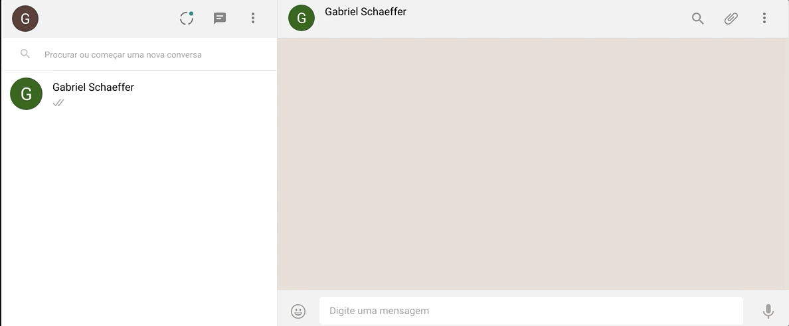

# WhatsApp Web clone

A clone of WhatsApp Web using pure JavaScript + Firebase and Auth - HCode course.
The project includes:

- Auth with Google accounts
- Notifications
- Real-time (Firebase)
- Audio
- Documents
- Access computers camera
- Messages status

## Chat with other users



## Send documents


## Like real WhatsApp :)


## Getting Started

Add your Firebase config in Firebase.js constructor, with Firebase bucket path as well.

```jsx
...
constructor() {
    this._config = {
        //Your Firebase config here :)
    };

    this.init();
}
...
```
Run the follow commands and the project will open on port 8080.

```sh
$ npm install && npm run start
```

## Authors

[Touqeer Hussain](https://github.com/htouqeer938/)

Web: [Touqeer Hussain](http://www.touqeerhussain.me/)

## License

This project is licensed under the MIT License - see the [LICENSE.md](LICENSE.md) file for details
